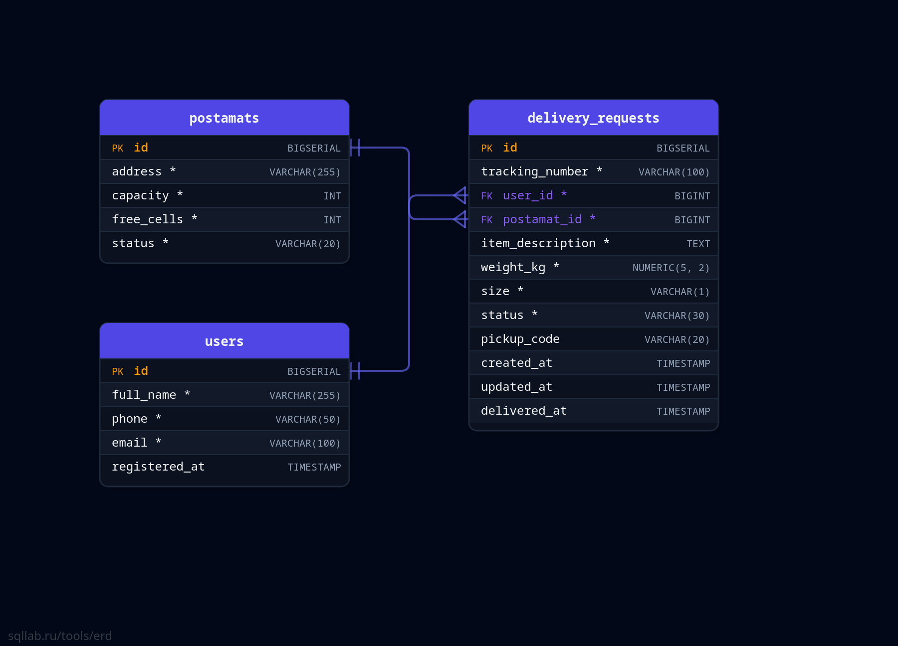

# Сеть постаматов — консольная информационная система

Контрольная работа №1. Дисциплина «Программирование корпоративных систем».

Предметная область — сеть постаматов. Основная сущность системы — **заявка
на доставку в постамат**. Приложение позволяет вести заявки на доставку,
учёт пользователей и постаматов, отслеживать статусы посылок, получать
статистику и экспортировать данные.

## Состав команды

| ФИО | Части работы |
|---|---|
| (вписать) | Модель данных, Repository-слой (JDBC, транзакции) |
| (вписать) | Service-слой, бизнес-правила, обработка ошибок |
| (вписать) | Консольный интерфейс, поиск, фильтрация, сортировка |
| (вписать) | База данных, статистика, экспорт, тестирование |

## Технологии

- Java 17 (enum, Stream API, Collections Framework, JDBC, var, switch)
- Maven (сборка исполняемого jar — maven-shade-plugin)
- PostgreSQL, подключение через JDBC (PreparedStatement)
- Apache POI — экспорт в Excel (.xlsx)

## Запуск

1. Требования: JDK 17+, Maven, PostgreSQL 14+.

2. Создать базу данных и выполнить скрипты (из корня проекта):

   ```bash
   psql -U postgres -c "CREATE DATABASE postamat_db;"
   psql -U postgres -d postamat_db -f db/schema.sql
   psql -U postgres -d postamat_db -f db/data.sql
   ```

   Либо через pgAdmin/DBeaver: создать базу `postamat_db`, открыть
   и выполнить `db/schema.sql`, затем `db/data.sql`.

3. Проверить параметры подключения в
   `src/main/java/ru/university/postamat/util/DatabaseManager.java`
   (по умолчанию пользователь `postgres`, пароль `postgres`).

4. Сборка:

   ```bash
   mvn package
   ```

5. Запуск исполняемого jar (из корня проекта):

   ```bash
   java -jar target/postamat-system-1.0.0.jar
   ```

   Или запустить класс `Main` из IntelliJ IDEA.

После запуска открывается главное меню:

```
=================== ГЛАВНОЕ МЕНЮ ===================
 1. Заявки на доставку (основная сущность)
 2. Пользователи
 3. Постаматы
 4. Статистика
 5. Экспорт данных
 6. Восстановить демо-данные
 0. Выход
====================================================
```

## Архитектура

Программа разделена на слои, SQL-запросы не находятся в коде меню:

```
Console UI (Main) -> Service -> Repository (JDBC) -> PostgreSQL
```

- **Main** — точка входа, всё консольное меню, вывод данных;
- **model** — классы-сущности и перечисления;
- **repository** — все операции с базой данных через JDBC;
- **service** — бизнес-логика, проверки бизнес-правил;
- **exception** — собственные исключения;
- **util** — подключение к БД, ввод с консоли, демо-данные.

```
src/main/java/ru/university/postamat/
├── Main.java
├── model/
│   ├── User.java                  # пользователь
│   ├── Postamat.java              # постамат
│   ├── DeliveryRequest.java       # заявка на доставку (основная сущность)
│   ├── DeliveryStatus.java        # статусы заявки + карта переходов
│   ├── PostamatStatus.java        # статусы постамата
│   └── DeliverySize.java          # габарит посылки (S/M/L)
├── repository/
│   ├── CrudRepository.java        # обобщённый интерфейс CRUD
│   ├── UserRepository.java
│   ├── PostamatRepository.java
│   └── DeliveryRequestRepository.java
├── service/
│   ├── UserService.java
│   ├── PostamatService.java
│   ├── DeliveryRequestService.java
│   └── ExportService.java
├── exception/
│   ├── BusinessException.java          # нарушение бизнес-правила / ошибка БД
│   └── EntityNotFoundException.java    # запись не найдена (наследник)
└── util/
    ├── DatabaseManager.java       # подключение к PostgreSQL
    ├── InputHelper.java           # безопасный ввод с консоли
    └── DemoDataManager.java       # восстановление демо-данных
```

## База данных

База `postamat_db`, три связанные таблицы.

- **users** — получатели отправлений (id, ФИО, телефон, email, дата регистрации);
- **postamats** — постаматы (id, адрес, всего ячеек, свободных ячеек, статус);
- **delivery_requests** — заявки на доставку (id, трек-номер, ссылка на
  пользователя, ссылка на постамат, описание товара, вес, габарит, статус,
  код получения, даты создания/обновления/выдачи).

Связи (один-ко-многим, внешние ключи):

```
delivery_requests.user_id     -> users.id
delivery_requests.postamat_id -> postamats.id
```

Ограничения: PRIMARY KEY, FOREIGN KEY, NOT NULL, UNIQUE (телефон, email,
адрес, трек-номер), CHECK (вес 0–30, ячейки 0..capacity, допустимые
значения статусов), индексы по внешним ключам и статусу.

Статусы в БД хранятся как VARCHAR с CHECK-ограничением; в Java им
соответствуют enum — получается двухуровневая валидация.

## ER-диаграмма

 

## Бизнес-правила

1. Заявка создаётся только на существующего пользователя и существующий постамат.
2. Постамат должен быть в статусе ACTIVE и иметь свободную ячейку.
3. Вес посылки: строго больше 0 и не более 30 кг.
4. Статус меняется только по допустимой карте переходов
   (CREATED → IN_TRANSIT → IN_POSTAMAT → DELIVERED / RETURNED;
   DELIVERED, RETURNED, CANCELED — конечные статусы).
5. Нельзя удалить заявку в статусах IN_TRANSIT и IN_POSTAMAT —
   её можно только отменить или вернуть.
6. Смена статуса и пересчёт свободных ячеек постамата выполняются
   в одной транзакции (SELECT ... FOR UPDATE + два UPDATE + commit,
   при ошибке — rollback).
7. Телефон и email пользователя уникальны (проверка в сервисе
   + UNIQUE в базе).
8. Выдача посылки — только по коду получения, который система
   генерирует в момент помещения посылки в постамат.

## Возможности

**Заявки на доставку (основная сущность):** создание, просмотр списка
и карточки, поиск по id и трек-номеру, редактирование (только в статусе
«Создана»), смена статуса по карте переходов, удаление.

**Поиск по заявкам (4 способа):** по трек-номеру, по описанию товара,
по ФИО получателя, по адресу постамата (ILIKE — без учёта регистра).

**Фильтры (5):** по статусу, по постамату, по получателю, по периоду
дат создания, по диапазону веса.

**Сортировки (5, Stream API + Comparator):** по дате создания (в обе
стороны), по статусу, по весу, по ФИО получателя.

**Статистика (6 показателей):**

1. всего пользователей;
2. всего постаматов (в том числе активных);
3. всего заявок и количество по каждому из 6 статусов;
4. средний вес посылки;
5. доля доставленных заявок, %;
6. доля отменённых заявок, %;
7. средний срок доставки (от создания до выдачи), дней;
8. самый загруженный постамат и топ-3 получателя по числу заявок.

**Экспорт данных:**

- основной формат — Excel (`export/postamat_export_YYYY-MM-DD_HH-mm.xlsx`,
  Apache POI, лист «Заявки»);
- дополнительный — CSV с разделителем `;` и экранированием.

**Восстановление демо-данных** (пункт меню 6): полная очистка базы
и заливка эталонного набора данных.

## Начальные тестовые данные

- 6 пользователей;
- 4 постамата (3 активных, 1 в обслуживании);
- 15 заявок, покрыты все 6 статусов:
  DELIVERED — 5, IN_POSTAMAT — 3, CREATED — 2, IN_TRANSIT — 2,
  CANCELED — 2, RETURNED — 1;
- даты заявок разбросаны за последний месяц — данные пригодны
  для демонстрации поиска, фильтрации и статистики.
